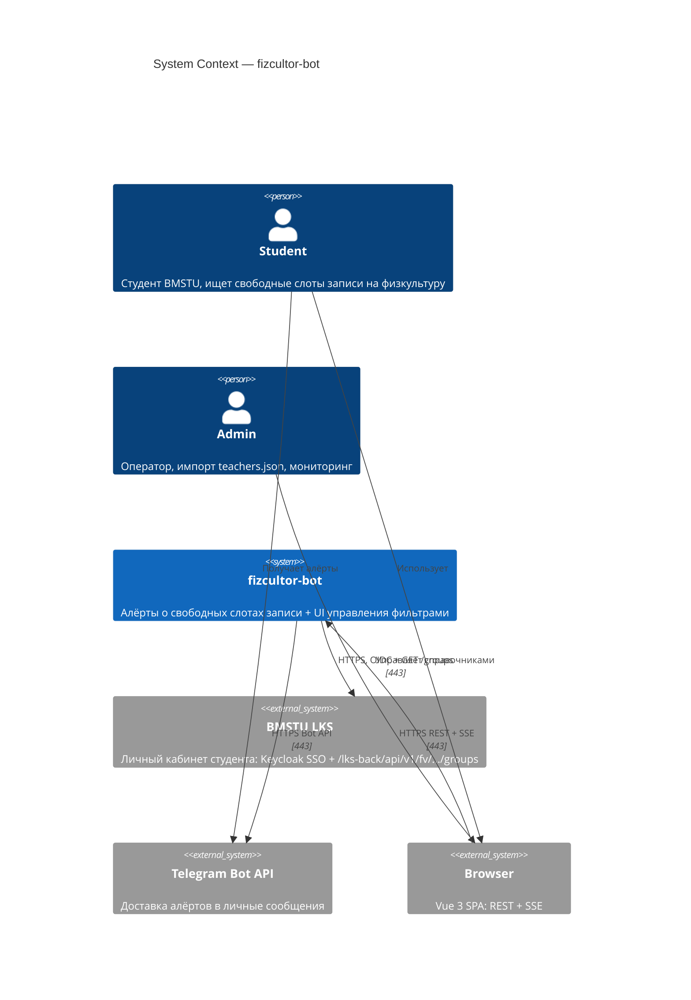
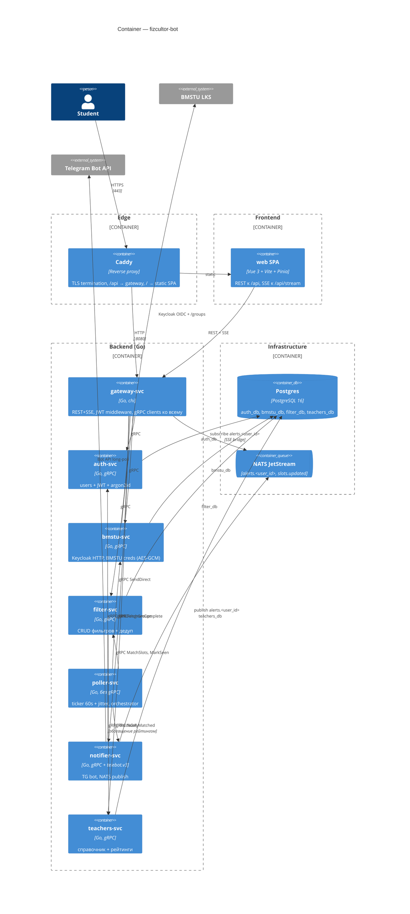
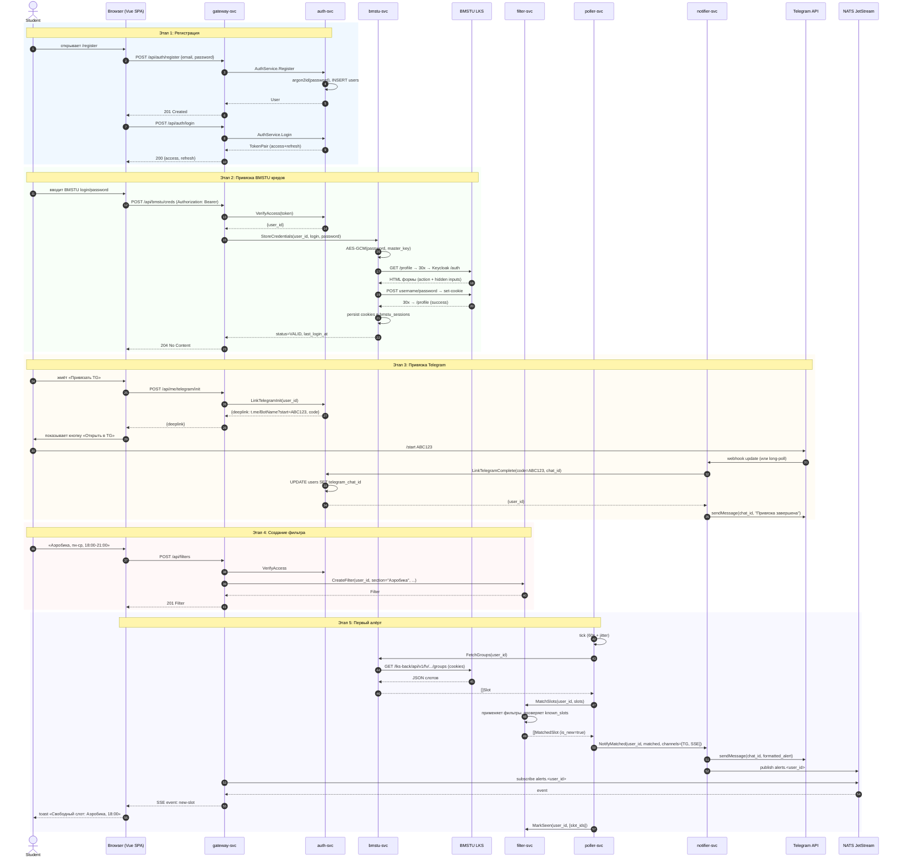
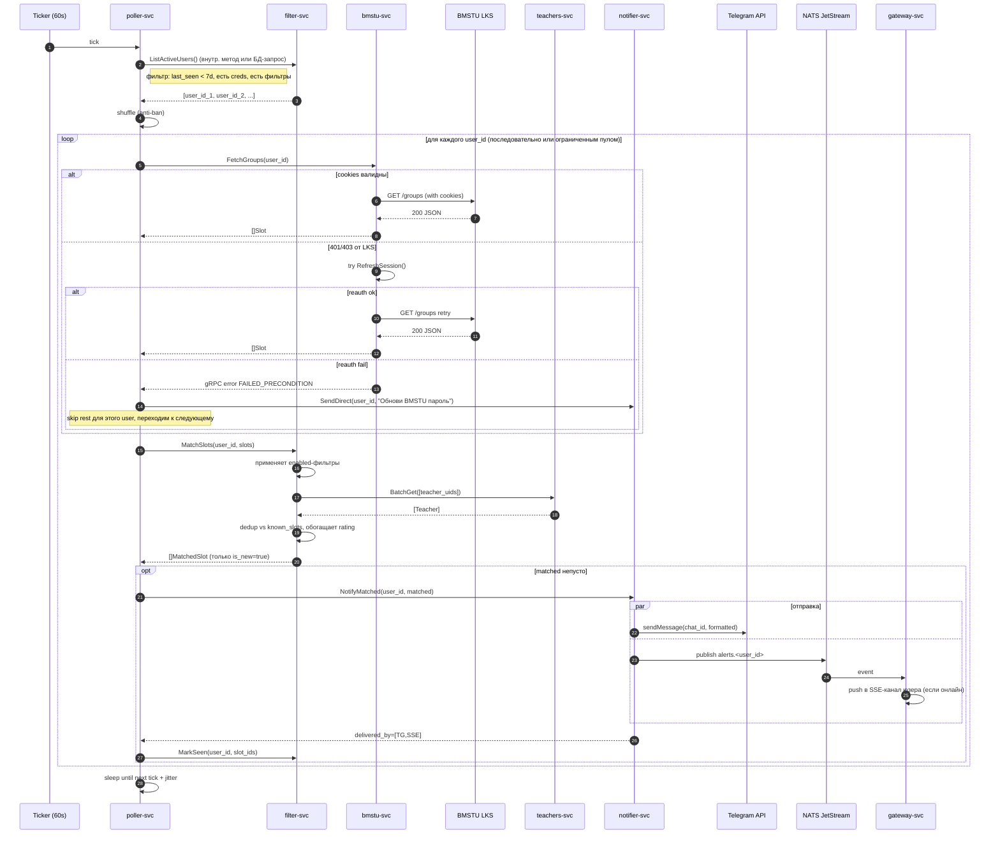
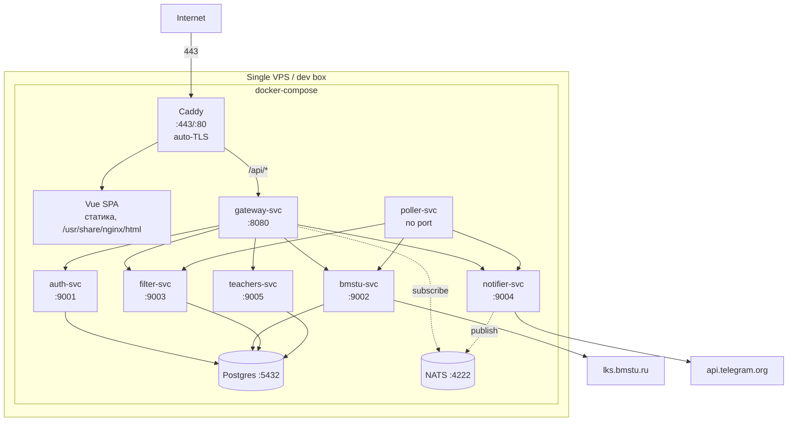

# Architecture — fizcultor-bot

Целевая архитектура переписанного BMSTU sport-sniper: Go-микросервисы за
gateway-svc, Vue 3 SPA фронт, NATS JetStream для алёртов, Postgres
(database-per-service).

См. также:
- [api.md](./api.md) — REST контракт gateway.
- [adr/](./adr/) — архитектурные решения с обоснованием.

---

## 1. C4 — System Context

Кто общается с системой и через что.

---

## 2. C4 — Container

Внутри fizcultor-bot: 7 Go-сервисов, 1 Vue SPA, Postgres, NATS, Caddy reverse-proxy.

**Ключевые наблюдения:**
- Никаких REST вызовов между Go-сервисами. Только gRPC и NATS.
- poller-svc — единственный источник тикеров, остальные сервисы реактивны.
- gateway-svc — единственная точка выхода во фронт; ни один внутренний сервис не имеет публичного HTTP.
- Postgres физически один инстанс; per-service — отдельные databases (логическая изоляция).

---

## 3. Sequence — Регистрация + линковка BMSTU + первый алёрт

End-to-end happy path для нового пользователя.

---

## 4. Sequence — Poll cycle (один тик poller-svc)

Детально что происходит каждые 60s ± 15s jitter.

**Резильентность:**
- Если bmstu-svc отвечает FAILED_PRECONDITION → poller НЕ вызывает MarkSeen → при следующем тике повторит.
- Если notifier упал между TG и MarkSeen → дубль алёрта на следующем цикле (приемлемо, лучше дубль чем потеря).
- circuit-breaker (`sony/gobreaker`) на LKS — при N подряд ошибках LKS приостанавливаем опросы на M минут.
- `known_slots` НЕ очищается при ошибке/пустом ответе LKS — фикс бага main.py:312.

---

## 5. Развёртывание (deployment view)

В prod каждый сервис — distroless-образ ~30 MB. Можно горизонтально масштабировать stateless-сервисы (auth, gateway, filter, teachers). bmstu-svc — карефул, cookiejar в памяти (если хотим scale-out — нужен sticky или session store в Redis, V2). poller — ровно 1 instance (выбор лидера если scale).

---

## 6. Cross-cutting

| Тема | Решение |
|---|---|
| Логирование | `slog` JSON в prod, текст в dev. Корреляция через `X-Request-ID` (генерится в gateway, прокидывается в gRPC metadata). |
| Трейсинг | OpenTelemetry, gRPC + HTTP middleware, экспорт в OTLP (опц. в V2). |
| Метрики | `/metrics` Prometheus в каждом сервисе (RED + business: алёрты доставлено/упало). |
| Healthchecks | `/healthz` (liveness) и `/readyz` (зависимости готовы) в gateway; gRPC health protocol во внутренних. |
| Конфиг | `caarlos0/env` из ENV; секреты — Docker secrets / `.env` (gitignored). |
| Шифрование при хранении | AES-256-GCM для BMSTU паролей, master-key из env `BMSTU_CREDS_KEY` (32 байта base64). |
| Транспортная безопасность | mTLS между gRPC-сервисами в prod (V2); в dev — plain text внутри docker network. |
| Идентификаторы | UUIDv7 для users/filters (лексикографически = по времени, индексы дружелюбнее), детерминированный sha1 для Slot.id. |

---

## 7. Что НЕ в scope этой версии

- Авто-запись на слот (реверс POST `/fv/new-record`) — V2.
- Web Push с VAPID — V2.
- Email через SMTP — V2.
- Admin UI — V2.
- Multi-tenant (несколько вузов) — V3.
- Grafana dashboards — настраиваются devops отдельно.

См. [adr/](./adr/) для архитектурных решений с обоснованием.
